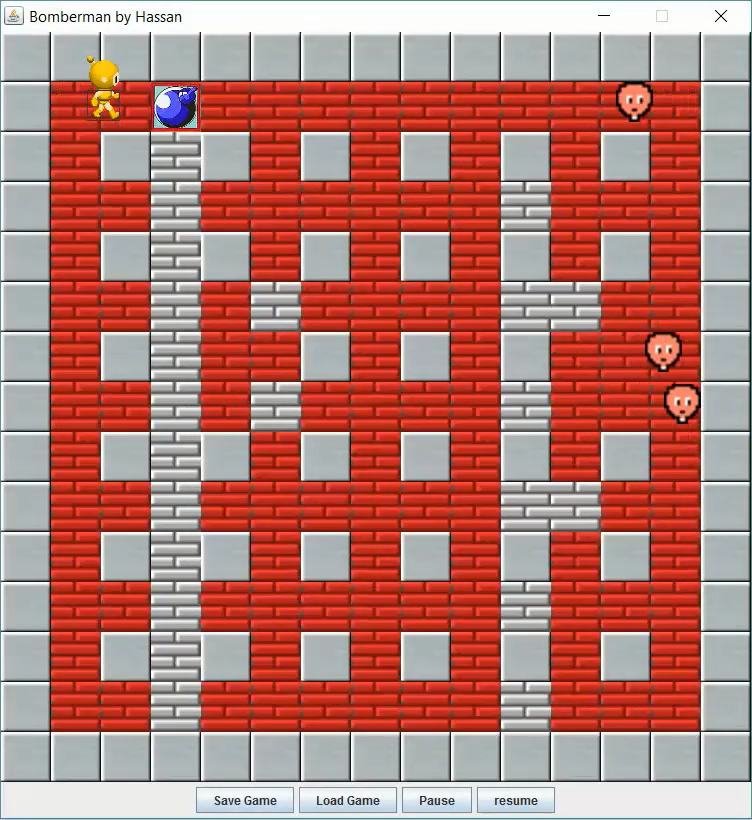
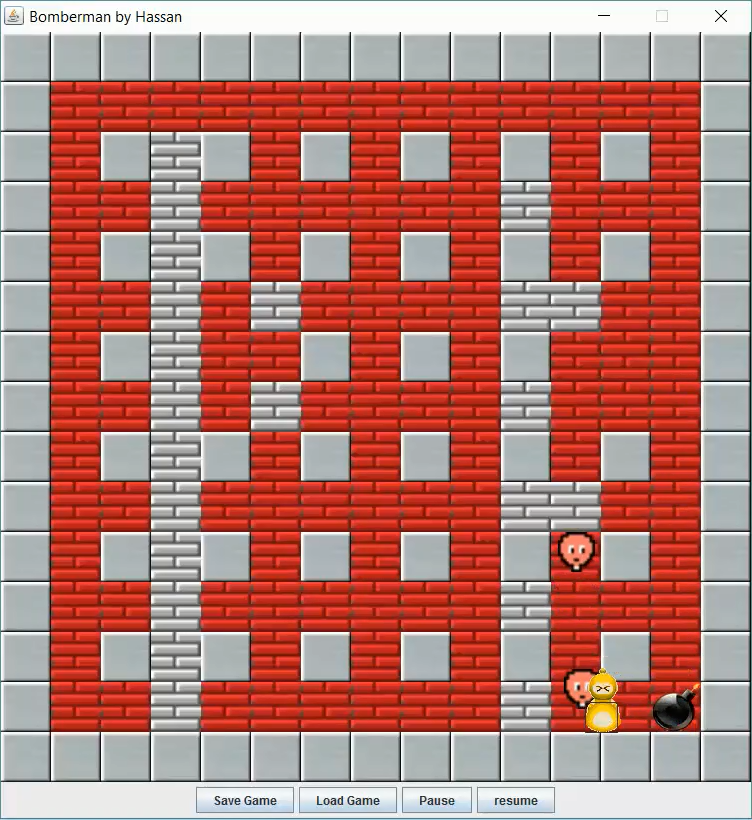
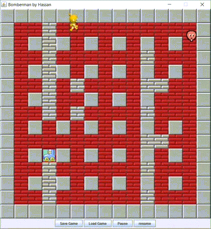

#### About
Bomberman arcade game written in Java using swing toolkit, as an assignment for Advanced Programming CS:300 Spring 2012-13, a course I look in my 2nd year of B.S. at LUMS.

#### Screenshots

Powerup:
 

 
Death:
 

#### Gifs

<!--  -->

#### Youtube
